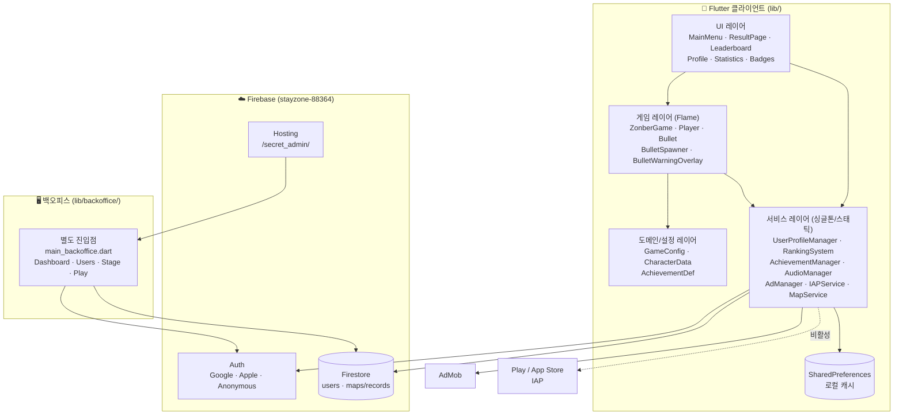
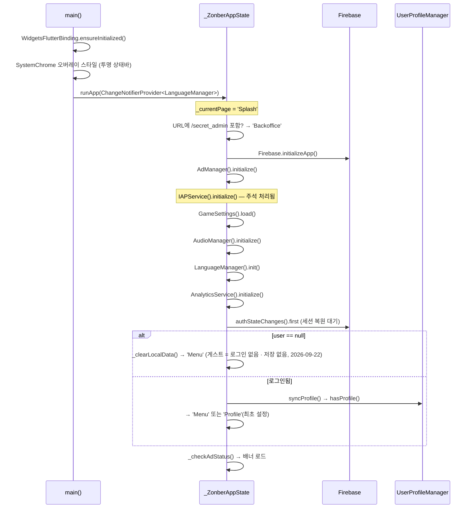
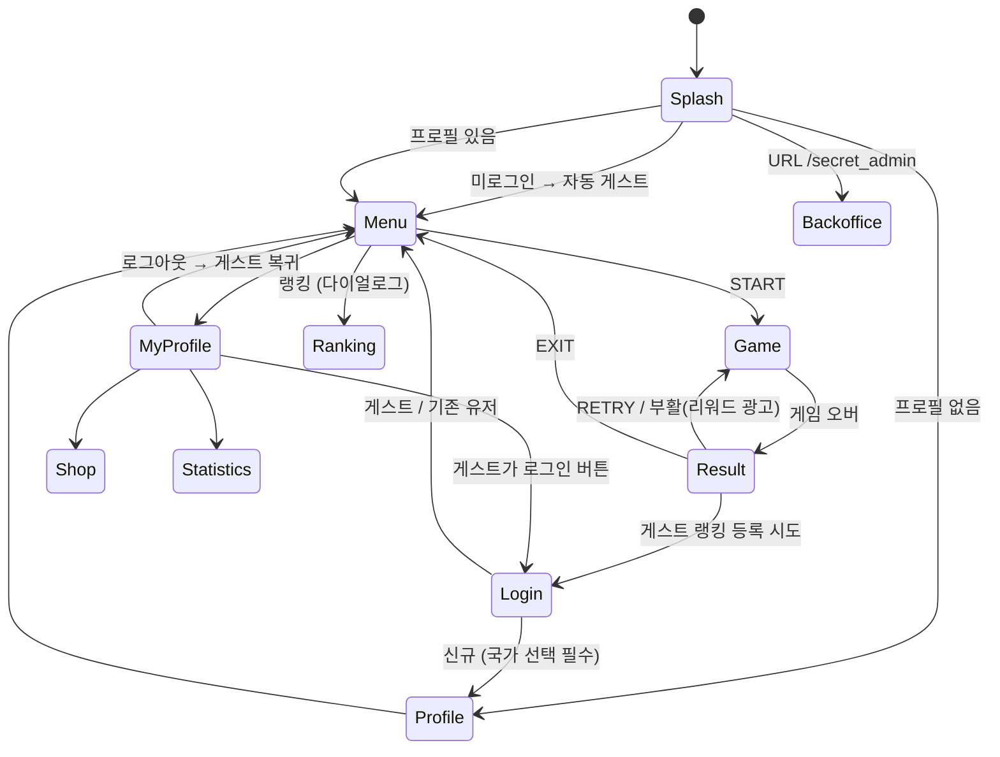

# ZONBER — 시스템 설계문서

> 코드베이스(`lib/` 35개 파일, 약 13,500 LOC)를 직접 읽고 작성한 설계 기준 문서입니다.
> 이 문서가 프로젝트 구조에 대한 **단일 진실 공급원(SSOT)** 입니다.
> `README.md`는 요약본, `CLAUDE.md`는 AI 에이전트용 작업 가이드입니다.

| 항목 | 값 |
|---|---|
| 작성 기준 | 앱 버전 `1.3.0+130`, 브랜치 `main` (워킹 트리 포함) |
| 최종 갱신 | 2026-09-18 |
| 패키지명 | `com.zonber.game` |
| Firebase 프로젝트 | `stayzone-88364` |
| Flutter SDK | `^3.10.1` / Flame `^1.34.0` |

---

## 1. 제품 개요

**ZONBER**는 Flutter + Flame으로 만든 하이퍼캐주얼 **탄막 생존(Bullet Hell Survival)** 게임이다.

- **목표:** 480×768의 고정된 존 안에서 사방에서 날아오는 탄막을 피해 최대한 오래 생존
- **승리 조건 없음.** 생존 시간(초, 소수점 3자리)이 곧 점수
- **패배 조건:** 에너지가 0인 상태에서 피격
- **조작:** 화면 어디든 **상대 드래그** (손가락이 캐릭터 위에 있을 필요 없음)
- **출시 범위:** 스테이지 3종 **전부 플레이 가능·항상 열림** — 1 Cyber(현행 네온 탄막) / 2 Dodgeball(코트 밖 4변) / 3 Keeper(골대 수비, 5골 게임 오버). 리더보드는 3개 모두 신규 mapId(zone_1_classic 미계승). 예고 표시는 진입 그림자 하나. 캐릭터 6종(생존 업적으로 순차 해금). 파워업은 2026-09 제거. 상세: [docs/STAGES.md](docs/STAGES.md)
- **UI v2 (2026-09-18):** 다크 + 월드 강조색, 하단 탭(홈·랭킹·프로필), 홈 월드 캐러셀, 게임 HUD 목표선·근접 회피, 결과 순위 카드, 뱃지(2026-09-22 명패·Hall of Fame 대체). 기획: [docs/UI_DESIGN.md](docs/UI_DESIGN.md), 월드: [docs/GAME_TYPES_DESIGN.md](docs/GAME_TYPES_DESIGN.md)
- **진입:** 첫 실행은 **게스트로 바로 플레이**(로그인 화면 없음). 랭킹 등록만 계정 필요 — 게스트 기록은 등록되지 않는다
- **계측:** Firebase Analytics (`services/analytics_service.dart`) — session_ready / game_start / game_over / revive / score_submit / guest_ranking_blocked
- **비주얼:** 다크 스페이스 + 네온 라인아트
- **수익 모델:** AdMob (배너 / 전면 / 리워드), IAP는 코드만 존재하고 **현재 비활성**
- **미출시 기능:** 광고 제거 IAP(`iap_service.dart` — 코드만 있고 초기화 안 함). 맵 에디터(UGC)·커스텀 맵·장애물 스테이지는 2026-09-22 코드째 제거

### 플랫폼 매트릭스

| 플랫폼 | 게임 | Firebase | AdMob | IAP | 비고 |
|---|:-:|:-:|:-:|:-:|---|
| Android | ✅ | ✅ | ✅ | 🔸 | 주 타깃 |
| iOS | ✅ | ✅ | ✅ | 🔸 | Apple 로그인은 iOS에만 노출 |
| Web | ⚠️ | 부분 | ❌ | ❌ | **백오피스 전용.** `RankingSystem`/`MapService`가 웹에서 Firestore 미초기화 |
| macOS/Windows/Linux | ⚠️ | ❌ | ❌ | ❌ | 개발 편의용, 미지원 |

🔸 = 코드 존재하나 `IAPService().initialize()`가 `main.dart`에서 주석 처리되어 비활성.

---

## 2. 시스템 아키텍처



### 레이어 규칙

| 레이어 | 대표 파일 | 상태 보유 | 규칙 |
|---|---|---|---|
| **도메인/설정** | `game_config.dart`, `character_data.dart`, `achievement_manager.dart`(정의부) | 없음 (`const`) | 순수 데이터. Flutter 위젯/Firebase 의존 금지 (`Color`/`IconData`만 예외) |
| **서비스** | `user_profile.dart`, `ranking_system.dart`, `achievement_manager.dart`(Manager), `audio_manager.dart`, `ad_manager.dart` | 싱글톤 또는 스태틱 | I/O 담당. 위젯 미의존 |
| **게임** | `main.dart` + `lib/game/*.dart`(part)의 Flame 컴포넌트들 | Flame 컴포넌트 트리 | `ValueNotifier`로만 UI에 상태 노출 |
| **UI** | `*_page.dart`, `*_widget.dart`, `design_system.dart` | `StatefulWidget` | 모든 문자열은 `LanguageManager.translate()` 경유 |

> ⚠️ **현실:** `main.dart` 2,639줄에 부트스트랩 · 라우팅 · 메인메뉴 · 게임 코어 · 결과 화면 · HUD가 모두 들어 있어 레이어 경계가 물리적으로 분리되어 있지 않다. §14 참고.

---

## 3. 앱 부트스트랩 & 라이프사이클

`main.dart:46 main()` → `ZonberApp` → `_ZonberAppState._initializeApp()`



**설계 의도:** 무거운 초기화를 `main()`이 아니라 `_ZonberAppState`로 옮겨 Android Watchdog 타임아웃을 회피한다 (`main.dart:51` 주석). `Splash` 페이지는 로그인 화면 깜빡임 방지용.

---

## 4. 화면 네비게이션

`Navigator` 라우팅을 쓰지 않는다. `_ZonberAppState._currentPage` **단일 문자열 상태**로 `_buildPage()`의 `switch`가 화면을 결정한다.



| 페이지 키 | 위젯 | 진입 경로 |
|---|---|---|
| `Splash` | 인라인 | 앱 시작 |
| `Login` | `LoginPage` | 게스트가 랭킹 등록 시도 / 프로필의 로그인 버튼 (첫 실행·로그아웃에는 뜨지 않음) |
| `Profile` | `UserProfilePage` → `InitialSetupPage` | 최초 설정 (닉네임 + **국가 필수**) |
| `Menu` | `HomePage` | 허브(하단 탭 0). 월드 캐러셀 |
| `Ranking` | `RankingPage` | 하단 탭 1. 월드 탭 × 기간 × 세계/국가 |
| `Game` | `Scaffold` + `GameWidget(ZonberGame)` | START / RETRY / 부활 |
| `Result` | `ResultPage` | 게임 오버 |
| `MyProfile` / `Shop` / `Statistics` | `ProfilePage`(하단 탭 2) / `ShopPage` / `StatisticsPage` | 프로필 탭 |
| `Backoffice` | `BackofficeHome` | 웹 URL `/secret_admin` |

**메인 메뉴 구성:** 프로필 칩 · 설정 아이콘 / 타이틀 / **게임방법 · 랭킹** 버튼 2개 / 캐릭터 선택 카드 / START.
랭킹은 페이지 이동이 아니라 `LeaderboardWidget` 다이얼로그로 띄운다 (`_showRankingDialog`).

**Android 백 버튼:** `_handleBack()`이 페이지별로 분기. `Menu`에서만 `null`을 반환해 `AppScaffold`가 앱 종료 다이얼로그를 띄운다 (`Login`은 게스트 세션 위에 뜨므로 Menu로 복귀). `Game`에서는 일시정지 다이얼로그.

**중요한 구현 제약:** `ZonberGame` 인스턴스는 `build()`가 아니라 `_navigateTo()` 안에서 생성한다. `build()`에서 만들면 배너 광고 로드 등으로 리빌드될 때마다 게임이 재시작된다 (`main.dart:253` 주석).

---

## 5. 게임 코어 (Flame)

### 5.1 좌표계

```
                  ┌─────────────────────────┐  ← camera.viewfinder.anchor = topCenter
                  │                         │
                  │   MapArea 480 × 768     │  clipRect로 잘라냄
                  │   (15 × 24 타일 @ 32px) │
                  │                         │
                  └─────────────────────────┘
                  │  worldHeight 800까지     │  하단 32px = UI 여백
                  └─────────────────────────┘
```

| 상수 | 값 | 위치 |
|---|---|---|
| `ZonberGame.mapWidth` | 480.0 | `main.dart:1251` |
| `ZonberGame.mapHeight` | 768.0 | `main.dart:1252` |
| `ZonberGame.worldHeight` | 800.0 | `main.dart:1254` |

카메라는 **고정**이다 (플레이어 추적 없음). `visibleGameSize = (480, 800)`으로 기기 해상도에 맞춰 스케일링된다.

### 5.2 컴포넌트 트리

```
ZonberGame (FlameGame, HasCollisionDetection, PanDetector)
├── world
│   ├── GridBackground        80px 격자 + 테두리 (렌더 전용, 히트박스 없음)
│   └── MapArea               480×768, clipRect
│       ├── Player            SpriteComponent, priority 10, anchor center
│       ├── BulletSpawner     로직 전용 Component
│       ├── Bullet × N        CircleHitbox(r=3.5)
│       ├── BulletWarningOverlay     priority 15, 렌더 전용
│       └── ParticleSystemComponent × N  (플레이어 트레일, priority 0)
└── (overlays: 'GameOverMenu' — 현재 미사용)
```

### 5.3 게임 루프와 UI 브리지

Flame 게임 루프와 Flutter 위젯 트리는 **`ValueNotifier` 2개로만** 연결된다. 게임 상태가 위젯 리빌드를 유발하지 않도록 하기 위함이다.

| Notifier | 타입 | 갱신 주체 | 소비자 |
|---|---|---|---|
| `survivalTimeNotifier` | `double` | `ZonberGame.update()` | 상단 타이머 텍스트 |
| `energyNotifier` | `({int current, int max, double chargeProgress, Color color})` | `Player._notifyEnergy()` (매 프레임) | `_EnergyHud` (5칸 고정 바) |

**게임 화면 레이아웃 (고정 높이):**

```
┌──────────────────────────────┐
│ [←]      TIME: 12.345        │  64px
├──────────────────────────────┤
│ ENERGY ▮▮▮▯▯                 │  32px  ← _EnergyHud (항상 5칸, 초과분은 잠금 표시)
├──────────────────────────────┤
│                              │
│      GameWidget (Expanded)   │
│                              │
└──────────────────────────────┘
```


### 5.4 충돌 처리

Flame의 `HasCollisionDetection`을 쓴다. (옛 장애물용 서브스텝 레이캐스트는 장애물과 함께 제거됨)

| 대상 | 방식 | 위치 |
|---|---|---|
| Player ↔ Bullet | Flame `onCollisionStart` | `main.dart:2391` |

> 장애물이 없어져 탄환 벽 반사(서브스텝 레이캐스트)와 플레이어 밀어내기는 2026-09-22 제거했다. 탄환은 `position += velocity * dt` 로 움직인다.

**히트박스 크기 (시각 크기와 다름 — 의도적 관대함):**

| 대상 | 시각 | 히트박스 |
|---|---|---|
| Player | 42 × 42 | **22 × 22** (중앙 정렬, 모든 캐릭터 동일) |
| Bullet | 9 × 9 | **반지름 3.5 원** |

### 5.6 색 규약 (가독성)

탄환과 장애물은 **절대 같은 색을 쓰지 않는다.** 밀집 상황에서 "피해야 할 것"과 "부딪혀도 되는 것"이 구분되지 않으면 게임이 성립하지 않는다.

| 요소 | 색 | 상수 |
|---|---|---|
| 탄환 | 빨강 `#D32F2F` + 흰 코어 | `AppColors.secondary` |
| 장애물/벽 | 스틸 그레이블루 `#9FB3C8` | `AppColors.obstacle` |
| 진입 경고 | 빨강 (탄환과 동일 — 같은 위협이므로 의도적) | `AppColors.secondary` |
| 플레이어 | 캐릭터 고유색 | `Character.color` |
| UI/그리드 | 시안 `#00B8D4` | `AppColors.primary` |

### 5.7 진입 경고 (`BulletWarningOverlay`)

맵 폭이 480인데 탄환 스폰 반경은 450px이라 **좌우 스폰 지점 상당수가 맵 밖**이다. `MapArea`에 `clipRect`가 걸려 있어 플레이어 입장에서는 보이지 않는 곳에서 갑자기 튀어나온다.

`BulletWarningOverlay`가 매 프레임 맵 밖 탄환을 훑어 진입 예상 지점(경계로 클램프한 좌표)에 짧은 막대를 그린다.

- 표시 조건: 경계까지 320px 이내 **AND** 맵을 향해 접근 중 (`velocity · toEdge > 0`)
- 가까울수록 진하고 굵게 (`alpha 0.25 → 0.9`, `strokeWidth 2.5 → 4.0`)
- 렌더 전용 컴포넌트. `priority 15`로 플레이어(10)보다 위에 그린다

### 5.5 난이도 램핑

스테이지별 초기값은 동일하고(`bulletSpeed: 150`, `spawnInterval: 0.10`), **시간 경과로만 난이도가 오른다.**

튜닝 값은 `BulletSpawner` 상단 상수로 모여 있다. **이 값을 바꾸면 기존 리더보드 기록과 난이도가 달라지므로 시즌 리셋을 함께 검토할 것.**

```
level = _startLevel + floor(survivalTime / _levelDuration)   # 1 + t/25

interval = 0.10 × 0.9^level                # 하한 _minInterval (0.02초)
speed    = clamp(150 + level×15, 0, 300)   # 상한 = 기본값 × 2
limit    = maxBullets + level×10           # 동시 탄환 상한
```

| 상수 | 값 | 의미 |
|---|:-:|---|
| `_startLevel` | 1 | 시작 레벨. 0이면 초반 무위험 구간이 길어진다 |
| `_levelDuration` | 25.0 | 레벨업 간격(초) |
| `_intervalDecay` | 0.9 | 레벨당 스폰 간격 배수 |
| `_minInterval` | 0.02 | 스폰 간격 하한 |
| `_speedPerLevel` | 15.0 | 레벨당 탄속 증가 |
| `_limitPerLevel` | 10 | 레벨당 동시 탄환 상한 증가 |

**스폰 방식:** 플레이어 중심 반경 **450px** 원주 위 랜덤 각도에서 생성 → 플레이어 위치 ±50px 랜덤 지점을 향해 발사. 장애물 내부 스폰은 스킵.

| 경과 | 레벨 | 간격 | 속도 | 상한(zone_1) |
|---|---|---|---|---|
| 0초 | 1 | 0.090s | 165 | 70 |
| 50초 | 3 | 0.073s | 195 | 90 |
| 150초 | 7 | 0.048s | 255 | 130 |
| 225초 | 10 | 0.035s | 300 (상한) | 160 |

> 비행 시간이 1.5~3초라 조준탄은 사실상 랜덤에 가깝다. 이 게임은 **밀도 소모전**이지 개별 탄환 회피 게임이 아니다. 난이도 조정 시 이 전제를 염두에 둘 것.

---

## 6. 게임 시스템

### 6.1 캐릭터 & 스탯 (`character_data.dart`)

**4개 축**으로 6종을 차별화한다. **히트박스(22×22)와 시각 크기(42×42)는 전 캐릭터 동일**하며, 스탯만 다르다.

| ID | 이름 | 체력<br/>`maxEnergy` | 속도<br/>`speedMultiplier` | 기력<br/>`energyCooldown` | 회피<br/>`iframeDuration` | 무적<br/>예산 | 해금 조건 |
|---|---|:-:|:-:|:-:|:-:|:-:|---|
| `neon_green` | Neon Green | 3 | 1.00 | 25s | 1.5s | 4.5s | 기본 |
| `electric_blue` | Electric Blue | 2 | 1.40 | 50s | 1.6s | 3.2s | 60초 생존 |
| `plasma_purple` | Plasma Purple | 2 | 0.85 | 10s | 1.3s | 2.6s | 120초 생존 |
| `cyber_red` | Cyber Red | 4 | 1.20 | 55s | 1.2s | 4.8s | 180초 생존 |
| `solar_gold` | Solar Gold | 5 | 0.70 | 35s | 1.0s | 5.0s | 240초 생존 |
| `void_dark` | Wraith | 1 | 1.25 | 18s | 2.5s | 2.5s | 300초 생존 |

- `energyCooldown`은 **에너지 1칸을 채우는 데 걸리는 초**다. 낮을수록 좋다.
- `iframeDuration`은 피격 후 무적 시간. **무적 중 닿는 탄환은 제거되므로** 이 값은 방어이자 돌파 수단이다.
- **무적 예산** = `maxEnergy × iframeDuration`. 실질 생존력을 가장 잘 나타내는 지표.
- 해금은 `unlockKey`(업적 키)로 판정한다. **이미 선택 중인 캐릭터는 조건과 무관하게 유지**되어 기존 유저의 선택을 뺏지 않는다.
- 렌더링은 코드 드로잉(`zonber_painter.dart`). 2026-09-22 1차 AI 아트(`assets/images/game/`·`GameArt`)는 제거했다 — 캐릭터·장비·공·이펙트는 전부 코드 드로잉.

### 6.2 조작 (상대 드래그)

`ZonberGame.onPanUpdate`가 `info.delta.global`을 누적하고, `Player.update()`가 그만큼 위치를 옮긴다. **절대 위치 추종이 아니라 상대 이동이다** — 손가락이 캐릭터 위에 있을 필요가 없고, 화면 아무 데나 드래그하면 된다. (따라서 "터치 오프셋"이나 "왼손잡이 모드" 같은 설정은 이 조작계에서 의미가 없다.)

```
최종 이동량 = 손가락 델타 × speedMultiplier × GameSettings.sensitivity
```

> ⚠️ **프레임당 이동량 상한이 없다.** 빠르게 스와이프하면 캐릭터가 그만큼 순간이동한다. 즉 캐릭터의 `speedMultiplier`는 실질적으로 **최고 속도가 아니라 감도(정밀도 대 이동량 비율)** 를 결정한다. 진짜 속도 상한을 두려면 `dragInput`을 `maxSpeed * dt`로 클램프해야 하는데, 그러면 1:1 드래그 감각이 사라진다. 이건 미해결 설계 결정이다 (§14).

### 6.3 에너지 시스템

```
게임 시작       → 에너지 = maxEnergy (최대치로 시작)
자동 회복       → 매 프레임 energy += dt / energyCooldown  (maxEnergy 상한)
피격 (energy≥1) → energy -= 1, 무적 iframeDuration초 + 깜빡임, 탄환 제거, 강한 진동
피격 (energy<1) → 게임 오버 (진동 3연타)
무적 중 피격    → 탄환만 제거, 소모 없음
```

**깜빡임은 무적이 끝날 때까지 계속된다.** 캐릭터마다 무적 시간이 1.0~2.5초로 다르므로 고정 횟수로 끊으면 "아직 무적인지"를 알 수 없다. 종료 직전 0.4초는 깜빡임 간격을 0.12s → 0.05s로 줄여 곧 풀린다는 신호를 준다.


HUD는 캐릭터 최대치와 무관하게 **항상 5칸**을 그린다. `i >= maxEnergy`인 칸은 잠금(회색) 표시, 충전 중인 칸은 `chargeProgress` 비율만큼 내부를 채운다.

### 6.4 파워업 시스템 — 제거됨 (2026-09-18)

속도/감속/실드/클리어 4종 파워업, 보관 슬롯, HUD 링, 가이드 아이템 탭이 모두 삭제됐다 (`powerup_system.dart` 파일 삭제). 실력 표현은 이동·무적 프레임뿐이며, 월드별 기믹은 [docs/GAME_TYPES_DESIGN.md](docs/GAME_TYPES_DESIGN.md)를 따른다.

### 6.5 월드 (`world_config.dart`) — 2026-09-18 골격

`WorldData.worlds`가 스테이지 목록의 단일 진실 공급원(난이도 순 3개, 항상 열림). 월드 = `difficulty` + `mode`(dodge/keeper) + `layoutId`(§6.5-1 레이아웃 기본값) + `projectiles`(`ProjectileDef`: 속도 배수·히트박스 반지름·시각 크기·straight/curve/homing/bounce·vanish/reflect·maxBounces·색) + `spawner`(ring = 플레이어/골대 중심 원주, sideline = 맵 4변 바깥 36px) + `spawnInterval`/`bulletSpeed` 오버라이드 + 테마(accent/floor/line) + `rankingMapId`(월드별 완전 분리·신규). **Keeper 모드:** `GoalZone`이 맵 중앙 `goalRadius` 원을 그리고, `Bullet.update()`가 원 안에 들어온 공을 `Player.concedeGoal()`로 실점 처리(목숨 = `lives` 5, 회복 없음). 플레이어가 공에 닿으면 `Player.onCollisionStart`가 세이브로 처리(카운터는 `grazeNotifier` 재사용, HUD 라벨 SAVES). 스포너는 골대 중심 반경에서 골대를 조준한다. **예고:** `BulletWarningOverlay`가 맵 밖 탄의 진입 지점에 그림자 타원을 그린다(막대·색·와인드업 없음). **아트 슬롯:** `assets/images/worlds/{id}_bg.png`(게임 배경, `_addStageBackground`)·`{id}_hero.png`(홈 카드) — 없으면 코드 드로잉. 현재 실아트(2026-09-18). 상세 기획: [docs/STAGES.md](docs/STAGES.md), 리소스: [docs/RESOURCES.md](docs/RESOURCES.md).

진행 데이터(`progress_store.dart`): 월드별 최고 기록(`world_best_times`, 해금 판정) · 순위 캐시(`world_rank_cache`, 결과 화면이 채움) — 로컬 + `users/{uid}.bestTimes`. 옛 명패(`world_plates`/`plates`)는 로그인 때 뱃지로 옮긴다. 순위는 `RankingSystem.getGlobalRank()`의 **count 집계**(전체 기간, 기록 단위)로 계산해 복합 인덱스를 피한다.

### 6.5-1 레이아웃 기본값 (`game_config.dart`)

모든 월드의 `layoutId`는 `zone_1_classic`(장애물 없음)이다. `GameConfig.getStage()`는 스포너의 기본 탄속(150)·스폰 간격(0.10)만 주고, 월드가 값을 정하면 월드 값이 우선한다.

> 2026-09-22 장애물 레이아웃(`zone_2_obstacles` 4기둥 · `zone_5_maze` 미로 + `maze_generator.dart`), 맵 에디터(`editor_game.dart`), 커스텀 맵(`map_service.dart`, `custom_*` mapId 로드)을 코드째 제거했다.
> 장애물 시스템(`Obstacle`, 탄환 서브스텝 벽 반사·`WallBehavior`, 플레이어 밀어내기)도 함께 제거했다. Firestore `custom_maps` 규칙은 `firestore.rules`에 그대로 있다.

---

## 7. 메타 시스템

### 7.1 랭킹 (`ranking_system.dart`)

**3개 기간** (`RankingPeriod`, 일일은 2026-09-18 제거) — 모두 **기기 로컬 타임존 기준**:

| 기간 | 시작점 |
|---|---|
| `weekly` | 이번 주 월요일 00:00 (로컬) |
| `monthly` | 이번 달 1일 00:00 (로컬) |
| `allTime` | **올해 1월 1일** (전체 기간이 아니라 연 단위) |

> UTC 기준이면 한국(UTC+9) 유저의 일간 랭킹이 **오전 9시에 리셋**되어 "오늘의 기록"이라는 개념이 어긋난다. Firestore `Timestamp` 비교는 절대 시각으로 이루어지므로 로컬 `DateTime`을 그대로 비교해도 정확하다.

**설계 핵심 — nickname → userId 전환:**

레코드는 더 이상 닉네임을 저장하지 않는다. `userId`만 저장하고, 읽을 때 `users` 컬렉션에서 닉네임/국기를 조인한다. 덕분에 **닉네임을 바꾸면 과거 기록에도 즉시 반영**된다.

```
saveRecord(mapId, time, {characterId, flag})
  └→ maps/{mapId}/records/{auto} = { userId, flag, survivalTime, characterId, timestamp }

getTopRecords(mapId, period)
  ├→ where(timestamp >= periodStart).limit(500)       # 단일 필드 → 복합 인덱스 불필요
  ├→ 메모리 정렬 (survivalTime desc) → take(30)
  └→ _enrichWithUserData(top30)
       └→ users where(documentId in [...])  # 30개씩 배치 (Firestore whereIn 상한)
          → nickname / flag 주입

getNationalRankings(mapId, flag, period)
  ├→ where(flag == flag).limit(500)                   # flag는 레거시 레코드에도 존재
  ├→ 메모리에서 기간 필터 + 정렬 → take(30)
  └→ _enrichWithUserData(top30)

getMyRank(mapId, userId, period)
  └→ where(userId == userId) → 기간 필터 → 최고 기록 1건 (rank는 항상 -1)
```

> **의도적 트레이드오프:** Firestore 복합 인덱스를 만들지 않기 위해 쿼리에는 단일 필드 조건만 걸고, 기간 필터·정렬을 클라이언트 메모리에서 처리한다. 대신 매 조회마다 최대 500 docs를 읽는다. 레코드가 500건을 넘으면 상위 30위가 부정확해질 수 있다.

`getGlobalPlayCounts()`는 `maps` 문서의 `playCount` 필드를 읽는다. 이 카운터는 **점수 등록 시점이 아니라 플레이 종료마다** `UserProfileManager.updateGameStats()`에서 증가한다.

### 7.2 업적 (`achievement_manager.dart`)

9종 / 3카테고리. `allAchs` 리스트 순서가 **곧 등급 순서**이며, `highestFrom()`은 리스트의 마지막 원소(=최고 등급)를 고른다.

| 카테고리 | 키 | 조건 | 아이콘 / 색 |
|---|---|---|---|
| 생존 | `ach_survivor` | 60초 | `shield_outlined` / 민트 |
| 생존 | `ach_veteran` | 120초 | `shield` / 시안 |
| 생존 | `ach_elite` | 180초 | `bolt` / 주황 |
| 생존 | `ach_master` | 240초 | `whatshot` / 자주 |
| 생존 | `ach_legend` | 300초 | `auto_awesome` / 금색 |
| 국가 | `ach_nat_champion` | 국가 랭킹 1위 | `emoji_events` / 핑크 |
| 글로벌 | `ach_glob_top30` | 글로벌 30위 이내 | `public_outlined` / 파랑 |
| 글로벌 | `ach_glob_top10` | 글로벌 10위 이내 | `public` / 보라 |
| 글로벌 | `ach_glob_champion` | 글로벌 1위 | `stars` / 흰색 |

**저장:** SharedPreferences(`user_achievements`) + Firestore `users/{uid}.achievements` **이중 저장**. 로그인 시 `syncFromFirestore()`로 합집합 병합, 로그아웃 시 `clearLocal()`.

**해금 시점:** `ResultPage._submitScore()` → `_unlockAchievements()`. 생존 업적은 즉시 계산하고, 순위 업적은 **3개 기간 × (글로벌 + 국가) = 6회 쿼리**(현재 `kShowAchievementBadges`로 비활성)로 자기 순위를 찾는다.

**리더보드 표시:** 각 행에 최고 등급 엠블럼(`_AchievementEmblem`)을 표시. 유저별 업적은 랭킹 로드 시 30개씩 배치 조회해 캐시한다. 엠블럼을 탭하면 `_UserProfilePopup`이 전체 업적 목록을 보여준다.

### 7.3 통계 (`user_profile.dart` + `statistics_page.dart`)

`UserProfileManager.updateGameStats(playTime, mapId)`가 게임 종료마다 호출되어:

1. `stats_total_play_time` += playTime
2. `stats_total_games_played` += 1
3. `stats_map_play_counts[mapId]` += 1 (JSON)
4. `stats_character_play_counts[characterId]` += 1 (JSON)
5. Firestore `users/{uid}`에 위 전부 + `platform` / `loginProvider` / `email` / `lastUpdated` 동기화 (`createdAt`은 최초 1회만)
6. Firestore `maps/{mapId}.playCount` += 1

통계 페이지는 총 플레이 시간 / 판수 / 평균 / 선호 맵 / **선호 캐릭터**를 표시한다. (레거시 타이틀 `getUserTitles`는 2026-09-22 제거 — 뱃지로 일원화)

### 7.4 프로필 & 인증

> **2026-09-22 변경:** 게스트는 익명 로그인을 하지 않고 아무것도 저장하지 않는다(게임 맛보기만). 아래 익명 로그인·게스트 플래그·전환 설명은 옛 구조다 — 현재는 CLAUDE.md 인증 절이 정본.

**게스트 기본화(2026-09-18):** 첫 실행은 `_enterAsGuest()`가 익명 로그인 + `enableGuestMode()` 후 바로 `Menu`로 보낸다. 로그인 화면은 게스트가 **랭킹 등록을 시도**하거나 프로필에서 로그인을 누를 때만 뜬다. 로그아웃도 로그인 화면 대신 게스트로 복귀한다.

**3가지 로그인:** Google / Apple(iOS 전용 노출) / 게스트(익명, 모든 플랫폼).

**프로필 필수 항목:** 닉네임(최대 8자) + **국가** — 단, **정식 계정에 한한다.**

**게스트는 국가 선택 없이 바로 플레이한다.** 게스트는 랭킹 등록 자체가 불가능하므로 국가를 물을 이유가 없고, 첫 플레이 전 폼 입력은 하이퍼캐주얼에서 이탈로 직결된다. `enableGuestMode()`가 `initial_setup_done`을 바로 마킹한다.

게스트 진입 시 **Firebase 익명 로그인**(`AuthService.signInAnonymously`)을 함께 수행한다. 세션이 기기에 저장되므로 앱을 재실행해도 로그인 화면을 다시 보지 않고, 통계·업적을 uid 기준으로 이어갈 수 있다.

**게스트 → 정식 계정 전환:** `hasProfile()`이 저장된 게스트 플래그와 **실시간 `FirebaseAuth.currentUser.isAnonymous`를 함께** 본다. 게스트 플래그가 켜져 있는데 익명이 아니면 업그레이드로 판단해 `initial_setup_done`을 내리고 최초 설정 화면으로 보낸다 (닉네임 + 국가 입력).

**국가 기본값 폴백** — 국가 필수화 이전 유저를 위해 3중 방어:
1. `hasProfile()`: 로컬에 국가 없으면 🇰🇷 South Korea로 설정
2. `syncProfile()`: Firestore 프로필에 국가 없으면 🇰🇷로 설정 후 원격에도 write-back
3. 백오피스 "국가 기본값" 버튼: 전체 유저 일괄 마이그레이션 (500건 배치 커밋)

**게스트 제약:** 랭킹 등록 불가(로그인 유도 다이얼로그) — **게스트 기록은 증발한다.** 계정 전환 시 uid가 바뀌므로 통계도 이어지지 않는다(의도된 결정, 2026-09-18). **리워드 광고 부활은 게스트도 가능하다** — 계정이 필요한 기능이 아니고, 광고 수익 관점에서 제외할 이유가 없다.

### 7.5 광고 (`ad_manager.dart` / `ad_helper.dart`)

| 형식 | 노출 시점 | 정책 |
|---|---|---|
| 배너 | 전역 (`AppScaffold` 하단) | `ads_removed` 구매 시 숨김 |
| 전면 | 게임 오버 **5회마다** | `_gameOverCounter >= 5`이고 프리로드 완료 시 |
| 리워드 | 결과 화면 "부활" | **세션당 1회**, 게스트 포함 전체. 사전 고지 다이얼로그 필수(AdMob 정책) |

`AdHelper.isReleaseMode = kReleaseMode`로 **자동 판별**한다. 릴리즈 빌드는 실제 광고 ID, 디버그는 Google 테스트 ID. 수동 토글 불필요.

부활 흐름: 리워드 획득 → `_reviveCount++` → `_navigateTo('Game', initialTime: 직전 생존시간)` → `ZonberGame`이 해당 시간부터 재개.

### 7.6 IAP (`iap_service.dart` / `shop_page.dart`) — 비활성

상품 3종(`remove_ads`, `nickname_ticket`, `country_ticket`)이 정의되어 있고 Android/iOS 별 상품 ID 매핑도 있으나, `main.dart`에서 `initialize()` 호출이 주석 처리되어 있고 `ShopPage`는 **"COMING SOON"만 표시**한다. `shop_page.dart`의 구매/복원/UI 함수 대부분이 미참조 상태(analyzer 경고).

---

## 8. 데이터 모델

### 8.1 Firestore

```
users/{uid}
├── nickname            string    최대 8자
├── flag                string    국기 이모지 (예: "🇰🇷")
├── countryName         string
├── characterId         string
├── achievements        string[]  업적 키 배열
├── totalPlayTime       number
├── totalGamesPlayed    number
├── mapPlayCounts       map       { mapId: count }
├── characterPlayCounts map       { characterId: count }
├── platform            string    Android / iOS / Web / ...
├── loginProvider       string    Google / Apple / Guest
├── email               string
├── createdAt           timestamp (최초 1회)
└── lastUpdated         timestamp

maps/{mapId}
├── playCount           number    전역 플레이 카운터
└── records/{auto}
    ├── userId          string    ★ 조인 키 (신규)
    ├── flag            string    국가 랭킹 쿼리용 (비정규화)
    ├── survivalTime    number
    ├── characterId     string
    ├── timestamp       timestamp
    └── nickname        string    ⚠️ 레거시 레코드에만 존재

custom_maps/{auto}        (옛 UGC — 앱에서 더는 쓰지 않음)
```

**비정규화 결정:**
- `flag`를 레코드에 중복 저장 — 국가 랭킹을 `users` 조인 없이 단일 `where`로 쿼리하기 위함
- `nickname`은 저장하지 않음 — 닉네임 변경이 과거 기록에 소급 반영되도록

### 8.2 SharedPreferences 키

| 키 | 타입 | 용도 |
|---|---|---|
| `sound_enabled` / `vibration_enabled` | bool | 설정 |
| `drag_sensitivity` | double | 드래그 감도 (0.6 ~ 1.8, 기본 1.0) |
| `language` | string | `en` / `ko` (기본 `ko`) |
| `user_nickname` | string | 표시 이름 |
| `user_flag_code` / `user_country_name` | string | 국가 |
| `user_character_id` | string | 선택 캐릭터 |
| `initial_setup_done` | bool | 최초 설정 완료 플래그 |
| `is_guest_mode` | bool | 게스트 여부 |
| `first_edit_available` | bool | 닉네임/국가 무료 1회 수정권 |
| `nickname_change_ticket` / `country_change_ticket` | int | 수정권 개수 |
| `ads_removed` / `manually_reset_purchases` | bool / string[] | 구매 상태 |
| `user_achievements` | string[] | 업적 키 캐시 |
| `stats_total_play_time` / `stats_total_games_played` | double / int | 통계 |
| `stats_map_play_counts` / `stats_character_play_counts` | string (JSON) | 통계 |

### 8.3 보안 규칙 (`firestore.rules`)

```
maps/{mapId}              read: 전체    write: 인증된 사용자
maps/{mapId}/records/{id} read: 전체    create: 인증된 사용자
users/{userId}            read: 인증됨  write: 인증된 사용자  ← 소유자 검사 없음
custom_maps/{mapId}       read: 전체    create/update: 인증됨
                          delete: authorUid == request.auth.uid
```

> 🔴 **보안 리스크.** `users/{userId}`의 write에 `request.auth.uid == userId` 조건이 없다. 백오피스가 익명 인증으로 남의 문서를 수정해야 해서 의도적으로 제거된 상태다(주석). 결과적으로 **아무 로그인 유저나 임의 유저 문서를 덮어쓸 수 있다.** 레코드 생성도 `survivalTime`/`userId` 값 검증이 없어 리더보드 위조가 가능하다. §14-6.

---

## 9. 다국어 (`translations.dart` / `language_manager.dart`)

- 구조: `Map<String, Map<String, String>>` — 외부 키 = 로케일(`en`/`ko`), 내부 키 = 문자열 ID
- 현재 **EN 251 / KO 251개**, 완전 일치 (`node scripts/check_translations.mjs`로 검증)
- `LanguageManager`는 `ChangeNotifier` 싱글톤. `Provider`로 주입되고, `main.dart`도 별도 리스너를 달아 전역 리빌드
- 폴백 체인: `현재 로케일 → en → 키 문자열 그대로`
- 동적 값은 `{placeholder}` 문법 (`invite_message_body` 등)

```dart
// 사용
LanguageManager.of(context).translate('game_over')

// 이벤트 핸들러 안에서는 listen: false
LanguageManager.of(context, listen: false).translate('paused')
```

**규칙: 사용자 노출 문자열은 반드시 EN + KO 양쪽에 추가한다.** `Edit`/`Write` 훅이 `translations.dart` 수정 시 `check_translations.mjs`를 자동 실행한다.

---

## 10. 디자인 시스템 (`design_system.dart`)

```dart
AppColors.primary       = #00B8D4  // 시안
AppColors.primaryDim    = #006064
AppColors.secondary     = #D32F2F  // 레드 (탄환/위험)
AppColors.background    = #050510  // 딥 스페이스 블랙
AppColors.surface       = #121212
AppColors.surfaceGlass  = #EE121212
AppColors.text          = white
AppColors.textDim       = #B0BEC5
```

| 컴포넌트 | 역할 |
|---|---|
| `NeonScaffold` | 표준 페이지 골격 (타이틀 + 백버튼) |
| `AppScaffold` | 최상위 래퍼 — 배너 광고 슬롯 + Android 백버튼 처리 |
| `NeonAppBar` / `NeonCard` / `NeonListView` | 레이아웃 |
| `NeonButton` / `NeonMenuButton` | 버튼 (glow, compact 모드) |
| `NeonDialog` / `showNeonDialog()` | 다이얼로그 |
| `AppTextStyles.{header, subHeader, body}` | 타이포그래피 |

폰트: `Orbitron`(제목/숫자, `google_fonts`), 기록 표시는 `monospace` + `FontFeature.tabularFigures()`로 자릿수 정렬.

> 게임 화면(`main.dart`)과 백오피스는 이 시스템을 부분적으로만 따른다. 게임 HUD는 하드코딩 색상(`#0B0C10`, `#0D0E12`)을, 백오피스는 자체 다크 테마(`#00FF88` primary)를 쓴다.

---

## 11. 백오피스 (`lib/backoffice/`)

게임과 **코드베이스는 공유하되 진입점이 분리**된 관리자 앱이다.

- 진입점: `lib/backoffice/main_backoffice.dart` (`flutter run -t ...`)
- 게임 앱 내부에서도 웹 URL에 `/secret_admin`이 포함되면 `BackofficeHome`으로 진입
- 인증: **익명 로그인**으로 보안 규칙을 통과 (별도 관리자 인증 없음)
- 배포: Firebase Hosting `hosting_root/secret_admin/`, 캐시 비활성 헤더

| 페이지 | 기능 |
|---|---|
| `dashboard_page.dart` | 총 유저 / 총 플레이(스테이지별 분해) / DAU / 플랫폼 분포. **마이그레이션 도구 2종** |
| `user_list_page.dart` | 유저 검색·조회·편집(`EditUserDialog`) |
| `stage_stats_page.dart` | 스테이지별 성과 분석 |
| `play_stats_page.dart` | 스테이지 × 캐릭터 교차 플레이 통계 |

**마이그레이션 도구** (`dashboard_page.dart`) — 둘 다 500건 단위 배치 커밋:
1. **국가 기본값** — `flag`가 빈 유저를 🇰🇷 South Korea로 일괄 설정
2. **레코드 국가** — `flag`가 빈 레코드를 `userId` → (실패 시) `nickname`으로 유저를 역추적해 채움

---

## 12. 빌드 · 배포 · 운영

### 12.1 명령어

```bash
flutter run                                        # 게임 실행
flutter run -t lib/backoffice/main_backoffice.dart # 백오피스 실행
flutter analyze                                    # 정적 분석
flutter build apk --release
flutter build appbundle --release
flutter build ios --release
```

### 12.2 운영 스크립트 (`scripts/`, Node.js ESM)

| 스크립트 | 용도 |
|---|---|
| `check_translations.mjs` | EN/KO 번역 키 누락 검사 |
| `test_rules.mjs` | `firestore.rules`를 배포 없이 Rules API 로 시험 (gcloud 토큰, 읽기 전용) |
| `make_sfx.py` | 효과음 합성 → `assets/audio/*.wav` |
| `make_stage_bg.py` | 피구·골키퍼 존 배경 생성 |

> 익명 클라이언트 SDK 로 쓰던 관리·마이그레이션 스크립트(seed/check/cleanup/audit 등)와 `scripts/package.json`은 2026-09-22 삭제했다. npm 의존성은 없다.

### 12.3 자동 훅 (`.claude/settings.local.json`, `PostToolUse`)

| 트리거 | 동작 |
|---|---|
| `translations.dart` 수정 | `check_translations.mjs` 자동 실행 |
| `game_config.dart` 수정 | 스테이지 추가 체크리스트 표시 |
| `character_data.dart` 수정 | 캐릭터 추가 체크리스트 표시 |

### 12.4 Firebase Hosting (`firebase.json`)

```
public: hosting_root
/                → 302 → /secret_admin/     ← 사이트 루트가 관리자 콘솔
/privacy         → 301 → /privacy.html
/secret_admin/** → rewrite → /secret_admin/index.html  (no-cache)
```

> ⚠️ SPA catch-all rewrite(`**` → `/index.html`)가 제거되어 있고 루트가 백오피스로 리다이렉트된다. 공개 랜딩 페이지가 필요하면 재검토 대상. §14-7.

### 12.5 Android 네이티브 주의사항

- 패키지 경로: `android/app/src/main/kotlin/com/zonber/game/`
- `google-services.json`의 패키지명이 `com.zonber.game`과 일치해야 함
- Firebase 호환을 위해 **MultiDex 활성화** 필수
- 드라이브가 섞인 환경(C:↔D:)에서 빌드 실패 시 `gradle.properties`의 `kotlin.incremental=false` 확인

### 12.6 릴리즈 체크리스트

1. `node scripts/check_translations.mjs` · `flutter test` 통과
2. `pubspec.yaml` 버전 증가 (`x.y.z+build`)
3. `flutter analyze` — 신규 warning 없음 확인
4. 광고 모드는 `kReleaseMode` 자동 판별 (수동 조작 불필요)
5. `flutter build appbundle --release`

---

## 13. 기능 추가 가이드

### 새 스테이지(월드)
월드는 `world_config.dart`의 `WorldData.worlds`에 추가한다(CLAUDE.md "새 월드 추가·활성화 시" 참고). 장애물 레이아웃 시스템은 2026-09-22 제거됐다.

### 새 캐릭터
1. `character_data.dart` — `availableCharacters`에 `Character` 추가
   - `CharacterStats` 4축 밸런싱. **maxEnergy × iframeDuration(무적 시간 총합)이 2.5~5.0 범위에 들어오는지** 확인할 것
   - `unlockKey`에 해금 업적 지정 (기본 해금이면 생략)
2. 그림 — 코드 드로잉(`zonber_painter.dart`). 이미지 에셋 없음
3. `translations.dart` — `char_{id}` 이름/설명 키 EN + KO
4. `statistics_page.dart` `_characterName()` / `_characterIcon()`에 분기 추가
5. `backoffice/play_stats_page.dart` `_characterNames`에 추가
6. 유료 캐릭터라면 `iap_service.dart` + `shop_page.dart` (현재 IAP 비활성)


### 새 업적
1. `achievement_manager.dart` — `AchievementDef` 상수 + `allAchs` 리스트에 **등급 순서대로** 삽입
2. 체크 함수를 최상위 함수로 정의 (`const` 생성자 제약)
3. 카테고리 리스트(`survivalAchs` / `nationalAchs` / `globalAchs`)에도 등록
4. `translations.dart` — `key` / `descKey` EN + KO

---

## 14. 알려진 이슈 · 기술 부채

우선순위 순. 각 항목은 코드에서 확인된 사실이다.

### 🔴 1. 업적 해금 쿼리 비용
`ResultPage._unlockAchievements()`가 게임 오버마다 **Firestore 리스트 쿼리 8회**(4개 기간 × 글로벌/국가)를 실행하고, 각 쿼리가 최대 500 docs를 읽는다. 플레이당 최대 4,000 document read + 유저 조인 쿼리. 유저가 늘면 비용과 결과 화면 지연이 선형으로 증가한다.
**조치:** 기간을 `daily` + `allTime`으로 축소하거나, 순위 계산을 Cloud Function으로 이전, 또는 결과 화면 표시와 분리해 백그라운드 처리.

### 🟡 2. 이동 속도에 상한이 없다
조작이 상대 드래그(§6.2)이고 프레임당 이동량이 클램프되지 않아, **최고 속도를 결정하는 건 캐릭터가 아니라 플레이어의 스와이프 속도와 터치 샘플링 레이트**다. `speedMultiplier`는 실질적으로 감도 배수로 동작하므로 "속도" 스탯 축이 의도만큼 차별화되지 않는다.
**조치:** `dragInput`을 `maxSpeed * dt`로 클램프하면 진짜 속도 스탯이 되지만 1:1 드래그 감각을 잃는다. 어느 쪽을 택할지가 남은 기획 결정.

### ✅ 3. 타이틀 / 업적 시스템 중복 — 해결(2026-09-22)
타이틀(`getUserTitles`)을 제거하고 뱃지(`badges.dart`)로 일원화했다.

### 🟡 4. 업적 상한이 300초에서 끝난다
생존 업적 최고 티어가 `ach_legend`(300초)이고 캐릭터 해금도 여기서 끝난다. 난이도 램프는 225초에 상한(속도 300 / 간격 0.035)에 도달하므로, 300초 이후로는 새로운 목표도 새로운 난이도 변화도 없다.
**조치:** 상위 티어 추가 또는 시즌제 도입.

### 🟡 5. 데드 코드
`flutter analyze` 기준 **error 0 / warning 15 / info 310**. info는 대부분 `avoid_print`와 `withOpacity` deprecated다.

남아 있는 미사용 코드는 전부 **미출시 기능에 딸린 것**이라 의도적으로 남겼다:
- `shop_page.dart` — 구매/복원/UI 함수 6개 미참조 (IAP 비활성)
- `backoffice/dashboard_page.dart` — 미참조 위젯 빌더 2개
- `user_profile.dart` — `_buildSettingRow` 등 미참조 3개
- `login_page.dart:56` — Apple 로그인의 `fullName` 미사용 (최초 로그인 시에만 제공되는 값이라 향후 필요)

### 🟡 6. Firestore 보안 규칙
- `users/{userId}` write에 소유자 검사가 없어 **인증된 아무 유저나 남의 프로필을 덮어쓸 수 있다** (백오피스 편집을 위해 의도적으로 제거된 상태)
- `records` create에 값 검증이 없어 **`survivalTime` 위조로 리더보드 조작이 가능**하다
- `maps/{mapId}` write가 열려 있어 `playCount` 임의 조작 가능
- 백오피스가 **익명 인증**만으로 동작한다 (URL만 알면 접근 가능)

**조치:** custom claims 기반 관리자 역할을 도입하고, 일반 유저는 `request.auth.uid == userId`로 제한. 점수 등록은 Cloud Function 경유로 전환.

### 🟢 7. Hosting 루트가 백오피스
`firebase.json`에서 `/` → `/secret_admin/` 302 리다이렉트, SPA catch-all rewrite 제거됨. 의도적이라면 문제없으나 공개 웹 랜딩이 필요하면 재설계 필요.

### 🟢 8. 에셋
- `assets/audio/`의 BGM/SFX 4개는 **합성 플레이스홀더**(2026-09-18, Node로 생성)다. 정식 에셋으로 교체 필요.

### 🟢 11. 숨김 상태인 뱃지·칭호
`kShowAchievementBadges = false`(`achievement_manager.dart`)로 리더보드 엠블럼·유저 팝업·통계 칭호·순위 업적 계산(§14-1의 8회 쿼리)을 끈 상태. 뱃지 구조 개편 후 플래그와 분기를 함께 제거할 것.

### 🟢 9. 웹에서 Firestore 미초기화
`RankingSystem`이 생성자에서 `!kIsWeb && (Android || iOS)` 조건으로만 `_db`를 설정한다. 웹에서는 랭킹이 전부 무동작(예외 없이 빈 값 반환). 백오피스는 자체적으로 `FirebaseFirestore.instance`를 직접 쓰므로 영향 없다.

### 🟢 10. 코드 구조
`main.dart` 약 2,700줄 / `user_profile.dart` 약 1,630줄 / `user_list_page.dart` 1,047줄. 특히 `main.dart`는 부트스트랩·라우팅·메인메뉴·게임 코어·결과·HUD·파워업이 한 파일에 있다.
**권장 분리:** `game/` (ZonberGame·Player·Bullet·PowerUp), `pages/game_page.dart`, `pages/result_page.dart`, `widgets/hud/`, `app_router.dart`.

---

## 15. 파일 인덱스

### 게임 코어
| 파일 | 줄 | 역할 |
|---|--:|---|
| `main.dart` | 2687 | 진입점 · 라우팅 · 메인메뉴 · Flame 게임 코어 · HUD · 결과 화면 · 파워업 · 진입 경고 |
| `game_config.dart` | 63 | 스테이지 정의 (SSOT) |
| `character_data.dart` | 185 | 캐릭터 6종 + 4축 스탯 + 해금 조건 |

### 메타 시스템
| 파일 | 줄 | 역할 |
|---|--:|---|
| `ranking_system.dart` | 288 | Firestore 리더보드 (4기간, 국가별, userId 조인) |
| `achievement_manager.dart` | 220 | 업적 9종 정의 + 이중 저장 |
| `user_profile.dart` | 1628 | 프로필·통계·티켓 관리 + 설정/프로필 페이지 |
| `statistics_page.dart` | 291 | 통계 + 레거시 타이틀 |

### UI
| 파일 | 줄 | 역할 |
|---|--:|---|
| `design_system.dart` | 550 | 네온 테마 컴포넌트 |
| `leaderboard_widget.dart` | 627 | 리더보드 (+ `leaderboard_widget_popup.dart` 214줄, `part of`) |
| `character_selection_page.dart` | 423 | 캐릭터 선택 (회전 이미지 + 파티클 + 4축 스탯 바 + 해금 잠금) |
| `shop_page.dart` | 424 | 상점 ⚠️ COMING SOON 스텁 |
| `game_guide_sheet.dart` | 215 | 게임 방법 가이드 (단일 페이지) |
| `login_page.dart` | 163 | 로그인 |

### 서비스 / 인프라
| 파일 | 줄 | 역할 |
|---|--:|---|
| `translations.dart` | 558 | EN/KO 251키 |
| `language_manager.dart` | 48 | 로케일 관리 (`ChangeNotifier`) |
| `ad_manager.dart` / `ad_helper.dart` | 187 / 97 | AdMob |
| `iap_service.dart` | 276 | IAP ⚠️ 비활성 |
| `audio_manager.dart` | 56 | BGM/SFX ⚠️ 에셋 없음 |
| `game_settings.dart` | 38 | 사운드/진동/드래그 감도 설정 |
| `services/auth_service.dart` | 103 | Firebase Auth 래퍼 (웹 팝업 분기 포함) |
| `firebase_options.dart` | 62 | FlutterFire 생성 파일 |

### 백오피스
| 파일 | 줄 | 역할 |
|---|--:|---|
| `backoffice/main_backoffice.dart` | 85 | 진입점 (익명 인증) |
| `backoffice/backoffice_home.dart` | 71 | NavigationRail 셸 |
| `backoffice/dashboard_page.dart` | 740 | 지표 + 마이그레이션 도구 |
| `backoffice/user_list_page.dart` | 1047 | 유저 관리 |
| `backoffice/stage_stats_page.dart` | 344 | 스테이지 통계 |
| `backoffice/play_stats_page.dart` | 272 | 스테이지 × 캐릭터 통계 |

### 싱글톤 목록
`GameSettings()` · `AudioManager()` · `AdManager()` · `IAPService()` · `LanguageManager()` — 전부 `factory` 패턴. `UserProfileManager`와 `AchievementManager`는 인스턴스 없이 **static 메서드**만 제공한다.
